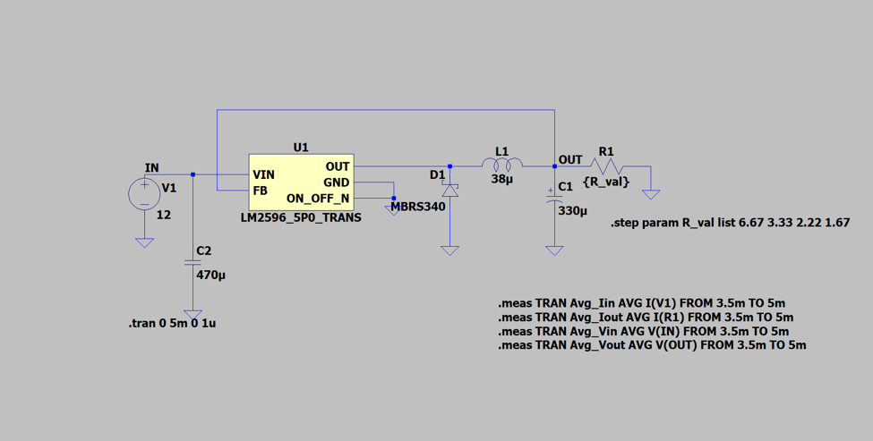
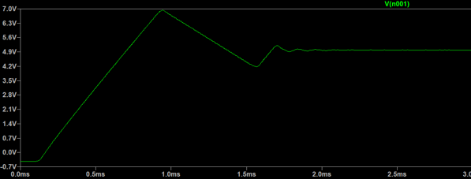
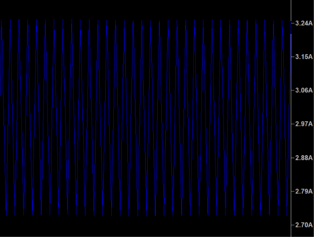
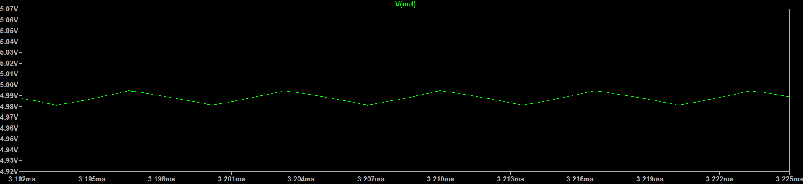
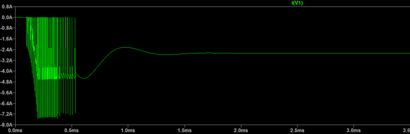
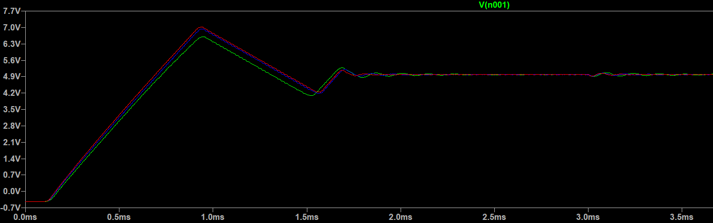

# LM2596 Buck Converter Simulation

## Overview
This project contains an LTspice simulation of a step-down converter using the LM2596 voltage regulator. The circuit steps down a 12V input to a 5V output. I completed this project to learn more about how LTSpice simulations are completed, and the different kinds of analysis that can be performed with a virtual simulation compared to a physical analysis.

## Circuit Design
* **Input Voltage:** 12V
* **Output Voltage:** 5V
* **Key Components:** LM2596 regulator, 38µH inductor, MBRS340 Schottky diode, 470µF input capacitor, 330µF output capacitor.
* **Testing Conditions:** I simulated steps through different load resistors (6.67Ω, 3.33Ω, 2.22Ω, and 1.67Ω). This tests the converter's performance at different output currents, all the way up to 3 A which was the specified current output.

## Schematic

### Component Selection
* **Inductor (38µH):** Chosen to keep ripple current under 0.6 (20% or 3A) at f_{switching} = 150kHz, using $`\frac{(V_{in} - V_{out}) \cdot V_{out}}{V_{in} \cdot L \cdot f_{switching}}`$ with $`f_{switching}`$ = 150 kHz (from the LM2596 datasheet). This gives a value of about 32.4µH, but I used the specific Schott Inductor recommended from the TI Datasheet, whose value I found based on the inductor code at the [Schott Website](https://schottmagnetics.com/thru-hole-lm259x-lm267x/).
* **Output Capacitor (330µF):** Chosen to keep output ripple voltage under 50mV (1% of 5V) given the ripple current above and the capacitor's ESR (26mΩ).
* **Diode (MBRS340):** Schottky, rated for 3A forward current / 40V reverse, asynchronous (diode-rectified) topology rather than synchronous, matching the LM2596's fixed internal switch architecture. I substituted the datasheet-listed parts, which are EOL, with the Schott 67148400.

## Data and Results
### Initial Simulation

I first simulated the circuit against a resistance of 1.67 ohms to measure the output current at the expected 3 A. The green curve demonstrates the movement of voltage as the converter starts up, overshoots, and then balances at 5V.

This zoomed in image of the current shows that it has a variation of about 0.5A, and stays under the 3.6 A that the components are rated for. The expected ripple current can be calculated using the previously mentioned formula $$`\frac{(V_{in} - V_{out}) \cdot V_{out}}{V_{in} \cdot L \cdot f_{switching}}`$$ which results in 0.511 A. Therefore, the graphical value remains under the expected ripple current.

This is the zoomed in image of the voltage, showing that it varies from 4.98V to 5V, demonstrating a stable output voltage.

### Inrush Current

This graph corresponds to the inrush current simulation. To ensure that the inrush current did not exceed the current ratings of the power supply, inductor, diode, and LM2596, I measured the current at the power source as the simulation started up. Specifically for the inductor, many of the inductors listed on the TI datasheet for the chip are out of production, so I decided to simulate the Schott 67148400 (L34) Inductor and its specifications.

### Step Load

After ensuring that the circuit performed as expected, I stepped the load to determine its performance at different current draws. To measure at 25%, 50%, 75%, and 100% current draws, I used resistance values of 6.67 Ω, 3.33 Ω, 2.22 Ω, and 1.67 Ω, using .step param R_val list 6.67 3.33 2.22 1.67 to move through each. Each curve corresponds to a resistor value, with the highest peak belonging to the 6.67 Ω resistor. Its light load causes slower drain, meaning it peaks much higher before it is able to stabilize. However, it is still well under the voltage rating for each component.

### Average Input/Output Power and Efficiency

After measuring the different loads, I measured their efficiency based on power calculated from the voltages and currents coming in and out of each resistor.

The value of efficiency was calculated with the formula $$\frac{V_{out} \cdot I_{out}}{V_{in} \cdot I_{in}}$$ and used to determine how the load affects the effiicency of the circuit. The trend in the graph shows how increasing the load draw will decrease the efficiency as expected, but the efficiency is maintained at above about 89%. One thing to note is that I_In will measure as a negative number because the voltage source is supplying power, so when calculations are performed, this number should be negated.

## Summary
The converter met its 5V/3A design target across the full load range, with efficiency staying above 89% even at full load, and ripple current/voltage matching hand calculations within simulation.

## Limitations & Future Work
This simulation covers transient behavior only, meaning startup, load steps, and steady-state ripple. It does not include an AC loop-gain analysis, so stability of the system as a closed loop is not verified. My next steps would be to perform an AC sweep of the feedback loop and eventually a physical prototype to compare against thermal and layout effects not captured in SPICE.

## How to Run
1. Download LTSpice from Analog Devices
2. Clone or download this repository
3. Ensure that the model for the LM2596 has been downloaded and is in the correct location
4. Open the 'asc' schematic file in LTSpice and run the following simulations for each section
   * Initial Simulation: Leave both comments as-is and replace {R_val} with 1.67
   * Inrush Current: Run the initial simulation but measure current out of the voltage source
   * Step Load: Uncomment the .step param comment and ensure the resistor value is {R_val}
   * Power and Efficiency: Uncomment both the .step param comment and the .meas comments, and ensure the resistor value is {R_val}
